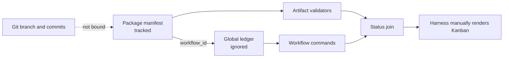

# Architecture analysis — 2026-07-21

## Scope and evidence

This assessment covers the complete Plan → Review → Apply → Verify orchestration,
the Status dispatcher, every class of generated file currently found under
`.codepatrol/`, the Git topology used by the current release branch, the public
skills and adapters, and the deterministic CLI seams that bind them.

Baseline: branch `v1-release`, commit
`165a8c99cf5f50281605b68846bfef7d8dd04810`. The checkout was clean before this
proposal created `.codepatrol/packages/2026-07-21-orchestration-redesign/`.
`main` points at `d1ea4f6`; the complete product and three already verified
packages coexist on `v1-release`. There is one worktree and only the `main` and
`v1-release` local branches, so several independent works have been executed on
one shared branch rather than one branch per plan.

Evidence gathered in this session:

- `codepatrol status --format json` initially returned zero workflows and zero
  packages, while the immediately following `codepatrol workflow prime` found
  13 non-closed roots and selected unrelated workflow `cpw-133700d8b80b` by
  recency. After this proposal created its own root, the ledger has 14 active
  roots: 6 `open` and 8 `waiting-user`.
- `.codepatrol/workflows/ledger.json` is 253,000 bytes and contains 206 items:
  34 workflow roots, 157 tasks, 13 memories, and 2 decisions. It has 24
  unfinished tasks, including 21 deferred tasks and one in-progress task.
- `codepatrol graph sync` scanned 58 files and produced graph v1 at
  `2026-07-22T02:11:08.634Z`, SHA-256
  `3a35aab35a92184b69c78c6bbf8d9eda7f7500d33adeba6cd176638464eb5d8e`.
  `codepatrol wiki status` reports the wiki absent, six missing expected pages,
  and four uncovered artifact-validator sources.
- `codepatrol graph impact` across the artifact, workflow, status, CLI, state,
  installer, skill-lint, smoke, and Pi seams found 34 affected files and 16
  affected tests. `src/cli/commands.ts` imports all three competing state
  modules. `src/status/service.ts` joins `src/artifact/service.ts` and
  `src/workflow/service.ts`, making the split explicit.
- The three tracked packages and their declared hashes were inspected.
  `lean-docs` and `post-apply-assessment` pass the plan-stage structural gate.
  `apply-orchestration-hardening` is status `verified` but now fails the same
  gate because its implemented `Create` paths exist in the current checkout.
  The gate therefore changes meaning after Apply and cannot validate a
  completed package against its original baseline.
- The v1 Plan checker also rejected later tasks that correctly declared a
  modification to a file created by an earlier dependency, because it checks
  every marker only against the present checkout. The v1 artifact uses explicit
  `Modify after Tn` annotations for those paths so the structural gate can pass;
  schema v2 must validate file intent against the dependency-produced tree.
- Local Pi package documentation and installed types show that assistant
  messages carry provider usage (`input`, `output`, cache reads/writes and
  `totalTokens`) and that the extension has `agent_end` events. Filesystem-only
  adapters expose no equivalent generic hook. Token accounting can therefore
  be measured automatically where a harness reports usage, but must explicitly
  say `unavailable` elsewhere; artifact size is not token spend.
- `npm run verify` is green at the target baseline: typecheck passes, all 185
  tests pass, build and compiled CLI smoke pass, and skill lint passes. This is
  the characterization floor for the breaking replacement.

No external technology research was required. The selected implementation uses
the repository's installed YAML dependency, Node standard library, existing
atomic store/lock/workspace modules, and the locally installed Git executable.

### Generated-file inventory and disposition

| Current path or artifact | Observed state | Problem | Target disposition |
|---|---|---|---|
| `.codepatrol/packages/<work-id>/handoff.yaml` | Tracked snapshot plus freely editable lifecycle fields | Duplicates lifecycle with the ledger; no branch or delivered commit binding; unknown fields are accepted | Replace with one event-backed `.codepatrol/changes/<work-id>/change.yaml` |
| `spec.md`, `plan.md`, `review.md`, `implementation.md`, `verification.md` | Tracked, flat, role-owned files | Flat ownership is implicit; evidence from different stages is mixed | Move under stage-owned `plan/`, `review/`, `apply/`, `verify/`, `finalize/` directories |
| `packages/.../evidence/` | Both governing Markdown and raw execution JSON | `lean-docs` contains eight tracked JSON files absent from its manifest, so the package hash does not bind every file | Require every durable file to be declared by its owning stage; keep raw logs in ignored runtime |
| `apply-orchestration-hardening` | Package verified at revision 2 | Its Apply root `cpw-f7cc15d62232` remains open and its plan gate is now red against the post-Apply tree | Preserve only in Git history during the v2 cutover |
| `lean-docs` | Package verified at revision 3 | Producer root is closed, but unbound evidence duplicates ledger summaries and command results | Preserve only in Git history during the v2 cutover |
| `post-apply-assessment` | Package verified at revision 3 | Apply and Verify roots remain `waiting-user` with instructions contradicted by the verified manifest; free-form revision history is unvalidated | Preserve only in Git history during the v2 cutover |
| `.codepatrol/workflows/ledger.json` | One ignored 253 KB document for every work and stage | Stage roots have no enforced foreign key to a package; stale roots are hidden by default Status; recency selection is unsafe | Remove global workflow concept; create disposable per-work/per-stage session ledgers under runtime |
| `.codepatrol/code-graph/graph.json` | Ignored 400 KB reproducible cache | Correctly local, but mixed at the root with unrelated state | Move to `.codepatrol/runtime/graph/graph.json` |
| `.codepatrol/wiki/manifest.json` | Ignored freshness cache while `docs/wiki/` is absent | A stale cache may survive without its durable bundle | Move to runtime and let wiki status rebuild or invalidate it |
| `.codepatrol/locks/` | Empty ignored runtime directory | Correct ownership, inconsistent root taxonomy | Move to `.codepatrol/runtime/locks/` |
| `.codepatrol/eval-runs/` | Empty ignored runtime directory | No declared retention/ownership | Move to `.codepatrol/runtime/evaluations/` and keep only summaries required by a Change |
| `.codepatrol/version.json` | Ignored runtime version stamp | Root-level runtime file | Move to `.codepatrol/runtime/version.json` |
| `main-consolidation-update.json`, `main-consolidation-close.json` | Ignored workflow input payloads left at root | Scratch inputs survive successful operations and resemble product state | Accept stdin or use auto-cleaned `.codepatrol/runtime/tmp/` |
| `scan-overview.json` | Ignored stale graph command output | Ad hoc report has no owner and contains an older graph snapshot | Remove; durable conclusions belong to Change evidence |
| `.codepatrol/adr/`, `.codepatrol/architecture/` | Empty directories | Two undocumented durable locations with no content | Remove; use `docs/adr/` and Change evidence |
| `.codepatrol/wiki/transactions/` | Empty recovery directory | Valid runtime concern at an inconsistent location | Move to `.codepatrol/runtime/wiki/transactions/` |

Two documentation paths currently say `.codepatrol/packagesflows/` rather than
`.codepatrol/workflows/`: `skills/_shared/ARTIFACTS.md` and
`docs/workflow-memory.md`. This is direct evidence that broad path renames and
duplicated contracts drift even when tests remain green.

## System overview



The manifest owns a package status, revision, artifact hashes, review approval,
verification verdict, and one overwritten stamp per step. The ledger separately
owns workflow-root status, child tasks, next action, memories, blockers and
claims. Skills create new roots for later stages, but the manifest records only
the producer root. Status intentionally hides ledger-only roots from its default
output (`src/status/service.ts:19-24`), although the Status skill says such roots
must appear in the Plan column. `workflow prime` selects the newest active root
(`src/workflow/service.ts:377-383`) even though the shared skill contract forbids
selection by recency. No deterministic module currently renders the Kanban;
`skills/codepatrol-status/SKILL.md:24-32` delegates table construction to the
language model.

Step provenance is also a lossy snapshot. `src/artifact/types.ts:27-31` stores
only `harness`, optional `model`, and `completed_at`; a rerun overwrites the
previous entry. It has no start time, attempt identity, token source, usage
coverage, active duration, or total. The post-apply manifest already carries an
extra `steps.apply.started_at` field that the permissive schema neither types nor
rejects, demonstrating schema drift.

## Candidates

### 1. Replace Package + Workflow with one branch-backed Change aggregate — `Strong`

- Files/seams: replace `src/artifact/`, `src/workflow/`, and `src/status/` with a
  deep `src/change/` module; route CLI and all primary skills through it.
- Problem: the current join has two independently writable lifecycle states,
  multiple IDs for one work, and no exact Git identity.
- Proposed shape: one tracked `change.yaml` contains immutable identity and an
  append-only sequence of validated events. Current stage, revision, attempts,
  next action, metrics, and terminal outcome are deterministic projections.
  Git provides the required branch/checkpoint/ref identity; ignored stage
  sessions provide rebuildable task progress only.
- Wins: one lifecycle truth, explicit branch, exact snapshots, history of
  retries, fail-closed transitions, deterministic board, honest token/time
  aggregation, and terminal commit/rollback.
- Risks: intentional breaking change, central Git orchestration, and a broad
  one-time rewrite of skills/docs/tests. Mitigate with injected Git adapters,
  fixture repositories, checkpoint tags, fast-forward-only integration, and a
  bootstrap cutover that ships no legacy compatibility layer.
- Verification implications: event-fold/property tests, crash-point and
  idempotency tests, Git fixture tests, golden Kanban snapshots, token coverage
  tests, full CLI/skill/installer gates.
- Recommendation: Strong.

```text
Before: package.status  +  workflow.status  +  current branch (implicit)
After:  Change events  ──project──▶ stage/attempt/next action/metrics
                       └─bind─────▶ branch/checkpoint/terminal tag
```

#### Design-it-twice interface A — minimal aggregate

```typescript
startChange(workspace, input): Promise<ChangeView>
transitionChange(workspace, workId, intent): Promise<ChangeView>
inspectChanges(workspace, query): Promise<ChangeView[]>
finalizeChange(workspace, workId, outcome): Promise<FinalizationResult>
```

The interface hides schema validation, artifact hashing, stage attempts, local
sessions, locks, Git checks, metrics, and recovery. A `GitAdapter` is injected;
production and in-memory/test adapters make the seam real. This is the selected
interface because all callers need the same invariants and no caller needs raw
manifest or ledger mutation.

#### Design-it-twice interface B — flexible repositories

Expose independent package, event, session, Git and metrics repositories to the
CLI and skills. This supports custom orchestration but recreates a shallow
surface: callers must learn ordering, rollback, lock, and cross-store
invariants. It is rejected because flexibility is exactly where current drift
enters.

#### Design-it-twice interface C — command-per-stage facade

Expose `sealPlan`, `approveReview`, `completeApply`, `verifyDelivery`, and
`finishChange`. It makes common calls clear but duplicates transition and
metrics logic across five entry points and makes return paths harder to prove.
The selected discriminated `transitionChange` keeps stage-specific payloads
while centralizing the invariant.

### 2. Add transactional reconciliation to the existing Package + Ledger pair — `Worth exploring`

- Files/seams: deepen `src/status/service.ts`, add package foreign keys to every
  workflow root, and make artifact/workflow writes share a transaction.
- Problem: it can detect many current inconsistencies without renaming public
  artifacts.
- Proposed shape: a coordinator writes both stores and a doctor repairs stale
  ledger roots from packages.
- Wins: smaller migration and greater reuse of current tests.
- Risks: two identities and two status vocabularies remain; ignored local state
  cannot participate in a portable atomic transaction; Git, metrics and
  finalization add a third source. Repair logic becomes a permanent semantic
  subsystem.
- Verification implications: cross-store failure injection and reconciliation
  matrices at every transition.
- Recommendation: Worth exploring only if compatibility were mandatory; it is
  not.

### 3. Encode the entire lifecycle in Git branches, commits and tags — `Speculative`

- Files/seams: remove package manifests and local sessions; infer stages from
  commit messages and tags.
- Problem: Git already supplies identity, history and rollback.
- Proposed shape: stage commits and terminal tags are the state machine.
- Wins: no custom lifecycle store and excellent branch visibility.
- Risks: uncommitted/interrupted work has no structured next action; artifact
  ownership and token/time data become commit-message conventions; parsing Git
  history is ambiguous after rebases and squashes; reviewers lose a stable
  human contract.
- Verification implications: extensive history-shape tests and restrictions on
  ordinary Git operations.
- Recommendation: Speculative. Use Git as a bound snapshot/locator, not as the
  only domain model.

## Selected correction

Promote candidate 1 as one independently reviewable replacement. The target is
a schema-v2 **Change** rooted at `.codepatrol/changes/<work-id>/change.yaml`:

```text
.codepatrol/
├── changes/<work-id>/              # tracked; one Change aggregate
│   ├── change.yaml                 # identity + validated append-only events
│   ├── plan/{spec.md,plan.md,evidence/}
│   ├── review/{report.md,evidence/}
│   ├── apply/{journal.md,evidence/}
│   ├── verify/{report.md,evidence/}
│   └── finalize/receipt.md
└── runtime/                         # ignored and wholly rebuildable
    ├── graph/graph.json
    ├── wiki/{manifest.json,transactions/}
    ├── sessions/<work-id>/<stage>/<attempt>.json
    ├── evaluations/
    ├── locks/
    ├── tmp/
    └── version.json

docs/
├── adr/                             # durable project decisions
└── wiki/                            # durable generated OKF bundle
```

The event fold is the only lifecycle state. It enforces this route:

```text
Plan → Review → Apply → Verify → Finalize → committed | rolled-back
  ↑      │         ↑       │
  └──────┘         └───────┘ implementation defect
  └───────────────────────── contract defect
```

Every stage may have multiple attempts. A return starts a new attempt and never
overwrites the cost or provenance of an earlier one. A block is an event on the
current attempt, not a competing package status. The projected next action
always names work id, branch and exact skill/command; no API selects by recency.

`codepatrol/<work-id>` is the only active branch name. `change start` requires a
clean Git checkout, records target branch and base commit, creates the branch,
and writes an initial system checkpoint. Stage completion writes a checkpoint
commit, so another branch or harness sees a clean, exact snapshot. Verify binds
its verdict to the candidate commit and tree. Finalize is a fifth lifecycle
skill and the only normal path allowed to integrate or discard the branch:

- `commit`: require an explicit user action, intact Verify commit verdict,
  unchanged target ref, clean tree, and fast-forward-only integration; write a
  terminal receipt/tag and delete the feature branch only after the target
  validates. The terminal tag preserves recovery.
- `rollback`: require explicit user action, write a rollback receipt and
  terminal tag, switch to the target, and delete the branch only after the tag
  preserves its last checkpoint. No production change reaches the target.

The deterministic board is produced by `scripts/render-kanban.mjs` through the
same pure projection/rendering code used by `codepatrol status`. It scans active
`codepatrol/*` branches, terminal `codepatrol/committed/*` and
`codepatrol/rolled-back/*` tags, and the current worktree overlay. It rejects
conflicting records, sorts by `created_at` then `work_id`, fixes locale and UTC
formatting, and renders Plan, Review, Apply, Verify and Finalize columns plus a
total. Active elapsed time is included only with an explicit `--as-of`; default
snapshots never depend on the render clock.

Each stage run records CLI-observed start/end timestamps and elapsed duration.
Provider-reported token usage records input, output, cache fields, total, model,
harness and source. A run whose harness exposes no reliable usage must record
`tokens.status: unavailable` and a reason. Board totals sum all attempts and
show coverage; for example, a partial total is labeled with measured runs over
total runs rather than presented as complete. Cycle time (first Change event to
terminal event) and summed closed-run active time are distinct. No raw
conversation or provider session is stored.

The current `v1-release` branch is the single bootstrap exception. After this
package is reviewed, applied and independently verified under v1, the user may
explicitly merge it into `main`. A guarded one-time cutover checklist then
deletes all tracked legacy packages and all ignored v1 runtime directories,
runs the complete gate on `main`, commits that cleanup, and deletes
`v1-release`. Git history retains the old evidence. No migration reader or
compatibility status is shipped; the first schema-v2 Plan starts from an empty
active Kanban.

Other candidates are out of scope because they are alternative architectures,
not independently useful additions. External schedulers, hosted state,
provider-specific memory, automatic pushes, non-fast-forward integration, and
silent rollback remain excluded.
